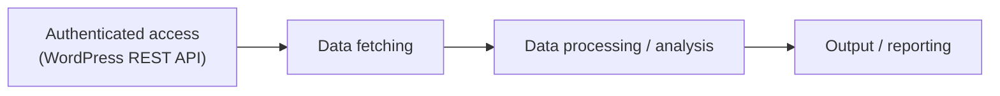

# Project Planning

> **Goal:** Grab content from a WordPress site (posts/pages, including authenticated/draft content from the editor's account) via the WordPress REST API, run analysis on that content, and produce a structured report as output follow 5 audit rules.

---

## MUST HAVE

- Authenticated WordPress REST API access
- Data fetching layer
- Data processing / analysis
- Output structuring / reporting
- Configuration & secrets handling
- Error handling & logging

## NICE TO HAVE

- Caching
- Comprehensive full test coverage

## ASSUMPTIONS

- No database is needed
- All required data can be retrieved via Wordpress REST API and is accurate and up to date
- Concurrency is handled properly — content edited in the WordPress editor while the API fetch is running is handled correctly (no partial/inconsistent reads)

# Architecture

A simple, high-level pipeline. Each stage feeds the next.

## The pipeline

1. **Authenticated access** — Log in to the WordPress REST API with the editor's credentials. Auth is required so the next step can read protected content (drafts, private posts).
2. **Data fetching** — Request the posts and pages from the API and pull back the content.
3. **Data processing / analysis** — Clean up the fetched content and run the analysis on it.
4. **Output / reporting** — Assemble the results into a structured report.
